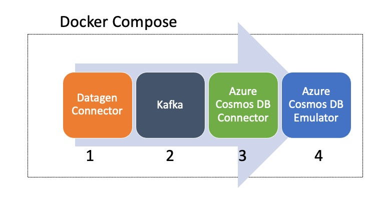

# Getting started with Kafka Connector for Azure Cosmos DB using Docker

Having a local development environment is quite handy when trying out a new service or technology. [Docker](https://docs.docker.com/) has emerged as the de-facto choice in such cases. It is specially useful in scenarios where you're trying to integrate multiple services and gives you the ability to to start fresh before each run. 

This blog post is meant to provide a getting started guide for the Kafka Connector for Azure Cosmos DB. All the components (including Azure Cosmos DB) will run on your local machine, thanks to: 

- The [Azure Cosmos DB Linux Emulator](https://docs.microsoft.com/azure/cosmos-db/linux-emulator?tabs=ssl-netstd21&WT.mc_id=data-30458-abhishgu) which can be used for local development and testing purposes without creating an Azure subscription or incurring any costs.
- And, [Docker Compose](https://docs.docker.com/compose/) which is a tool for defining and running multi-container Docker applications. It will orchestrate all the components required by our setup including Azure Cosmos DB emulator, Kafka, Zookeeper, Kafka connectors etc.

To make things easier, we will pick single-focused scenarios and go step by step:

- Step 0 - A simple scenario to check if our setup if functional.
- How to handle streaming JSON data
- How to handle streaming JSON data which is *not* compatible with Azure Cosmos DB
- How to handle Avro data using Schema Registry
